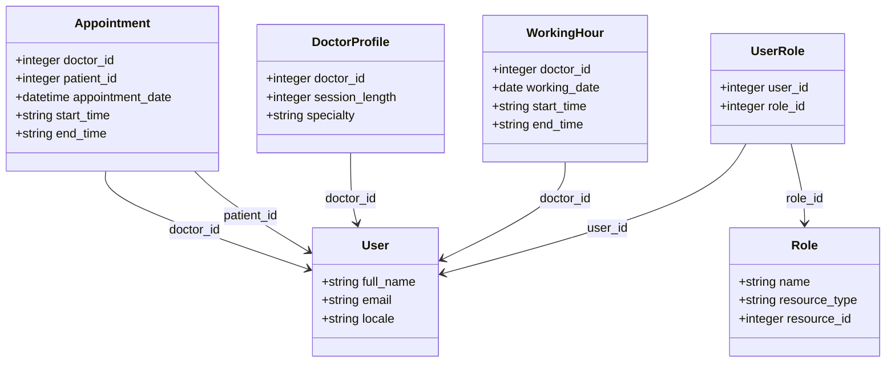

# Solution Document

## Thought Process

This is a RESTful API service that enables a simple scheduling system. It
manages doctor availabilities and allows patients to book/edit appointments.

- It uses Ruby on Rails v7.1.x, Ruby v3.3.x as the framework and PostgreSQL as
the database.
- It is dockerized and uses docker-compose to run the application.
- It uses Sidekiq to send email confirmations, updates and reminders.
- The responses use JSON format produced by the Active Model Serializers gem.
- The strings are translated using the i18n gem to keep the consistency of the messages.

The main goal of the Clinic Challenge project is to create a robust, secure, and scalable API service for managing doctor appointments. Here is a summary of the key considerations and decisions made during the development process:

### API Structure

The API endpoints are versioned and follow the RESTful conventions. The access to the API endpoints is protected by authentication. The users must be authenticated to access the endpoints. Authentication is done using JWT tokens. The user must provide a valid token to access the API endpoints.

### Response Serialization

The responses are serialized using the Active Model Serializers gem to ensure consistency and flexibility in the API responses. The serializers are used to customize the JSON output of the API responses.
For the Availability, given that it's not a model, a wrapper serializer is used to format the response.

### Dockerization

The application is dockerized to ensure consistency across different
environments and to simplify the deployment process.

### Gemfile Selection

The gems used in the project are selected based on the requirements of the project. The gems are chosen to provide the required functionality and to keep the codebase clean and maintainable.

### Background Jobs

Background jobs are used to send email confirmations, updates, and reminders. It uses Sidekiq to process the jobs asynchronously. The jobs are queued and processed in the background to avoid blocking the main application.

### Emails sent in development

Because we are using the `letter_opener` gem, the emails are saved in the `tmp/letter_opener` folder. This way, we can check the emails sent by the system without sending them to the real email addresses.

### Localization

The strings in the application are translated using the i18n gem to support multiple languages. Also, the locale of the user is used to determine the language of the email notifications sent by the system.

### Tests

The project includes unit tests to ensure the correctness of the code and the functionality of the API endpoints. The tests are written using RSpec and FactoryBot to create test data.
It doesn't cover all the cases due to time constraints, but it covers the main functionalities for the controllers.

### Environment Variables

Sensitive information such as the database credentials, JWT secret key, and Sidekiq web settings are stored in environment variables to ensure security and to keep the configuration separate from the codebase.

> [!NOTE] Repository includes the .env file for demonstration
> For demonstration purposes, the `.env` file is included in the repository. In a production environment, the environment variables should be set in the server configuration (for example using AWS Parameter Store.

## Data Models

### User

Doctor, patients and admins are users. So, I will use just the `User` model to
store the users data. The `User` model has the following fields (in addition to the default fields provided by Devise):

| Field                 | Type     | Description                              |
|-----------------------|----------|------------------------------------------|
| full_name             | string   | The user's full name                     |
| email                 | string   | The user's email                         |
| locale                | string   | The user's locale (default: "en")        |

**Notes**:

- The locale of the user is used to determine the language of the email notifications sent by the system.

### User Roles

The `User` model has a many-to-many relationship with the `Role` model. The `User` model has the following fields:

| Field    | Type   | Description        |
|----------|--------|--------------------|
| user_id  | integer | The ID of the user |
| role_id  | integer | The ID of the role |

### Doctor Profiles

The `DoctorProfile` model stores the doctor's profile information. The `DoctorProfile` model has the following fields:

| Field          | Type     | Description                        |
|----------------|----------|------------------------------------|
| doctor_id      | integer   | The ID of the doctor (FK)          |
| session_length | integer  | The length of a session in minutes |
| specialty      | string   | The specialty of the doctor        |

The `session_length` field is used to determine the length of the appointment sessions.

### Working Hours

Working hours are the hours that a doctor is available to see patients.

| Field        | Type   | Description                         |
|--------------|--------|-------------------------------------|
| doctor_id    | integer | The ID of the doctor (FK)           |
| working_date | date   | The working date                    |
| start_time   | string | The start time of the working hours |
| end_time     | string | The end time of the working hours   |

**Notes**:

- The doctors can have different working hours for each day. So, I'll store the working hours for each day. For example, a doctor can work from 8:00 to 12:00 and from 14:00 to 18:00 on Monday.
- The start_time and end_time fields are strings to store the time in a human-readable format: `HH:MM`.

### Appointments

| Field            | Type     | Description                       |
|------------------|----------|-----------------------------------|
| doctor_id        | integer   | The ID of the doctor (FK)         |
| patient_id       | integer   | The ID of the patient (FK)        |
| appointment_date | datetime | The date of the appointment       |
| start_time       | string   | The start time of the appointment |
| end_time         | string   | The end time of the appointment   |

**Notes**:

- Appointments can be created, updated and deleted by the patients who have booked the appointment. Also, the doctor can update or delete the appointment.
- Doctors can not book appointments with themselves.
- Patients can not book more than one appointment with the same doctor on the same day.
- Every time an appointment is created, updated or deleted, an email notification is sent to the patient.
- Also, an email is sent to the patient 24 hours before the appointment date as a reminder.
- The end time of the appointment is calculated based on the session length of the doctor.
- The start_time and end_time fields are strings to store the time in a human-readable format: `HH:MM`.

## Class Diagram

## Services

### DoctorAvailabilityService

The `DoctorAvailabilityService` class is a service object responsible for managing and calculating the availability of doctors for appointments.

This class includes several methods to handle the logic of determining if a doctor is available at a specific time, if an appointment is within the doctor's working hours, and calculating free intervals based on the doctor's existing appointments and working hours.

#### Initialization

Takes a `doctor` object and an optional `date` as parameters.
Resolves the date to either a specific date or a range of dates (defaulting to today through 6 days from now).

#### Working Hours and Availability

- **working_hours**: Fetches the working hours of the doctor for the specified date(s).
- **availability**: Calculates the availability slots for the doctor based on their working hours and existing appointments.

#### Availability Checks

- **available_at?**: Checks if the doctor is available at a specified start time.
- **appointed_at?**: Similar to available_at?, but this could be used for different logic or extensions in the future.
- **appointment_within_working_hours?**: Verifies if a specified appointment time is within the doctor's working hours.

## Jobs

### AppointmentNotificationJob Class

The AppointmentNotificationJob class is a background job responsible for sending email notifications related to appointment actions. This class includes the Sidekiq job module to process the job asynchronously, ensuring that email notifications do not block the main application thread.
In development, the emails are sent using the `letter_opener` gem, which saves the emails in the `tmp/letter_opener` folder.

#### Job Initialization

- Takes `appointment_id` and `action` as parameters.
- Finds the appointment using Appointment.with_deleted.find(appointment_id) to include soft-deleted appointments.

#### Action Handling

- Depending on the action (create, update, destroy), the corresponding email is sent using the AppointmentMailer.
- Emails are sent immediately using deliver_now.

### DailyAppointmentReminderJob Class

The DailyAppointmentReminderJob class is a background job responsible for sending reminder emails for appointments scheduled for the next day.

#### Job Initialization

- Finds all appointments scheduled for the next day.

#### Reminder Handling

- Iterates over each appointment and sends a reminder email using the `AppointmentMailer`.
- Emails are sent immediately using deliver_now.

## Future Improvements

These are some of the potential improvements that could be made to the project.

- **Missing tests**: Add missing tests for the models and services. This is very important to ensure the correctness of the code, the functionality of the API endpoints and future-proof the codebase.
- **Caching**: Implement a caching mechanism to improve the performance of the API endpoints. For example, caching the doctor's availability slots for a specific date range.
- **Endpoints protection**: Implement a rate-limiting mechanism to prevent abuse of the API (for example using the rack-attack gem).
- **Exception alerting**: When the retries of the background jobs are exhausted, the job should send an alert to a monitoring system (for example Sentry) to notify the developers.
